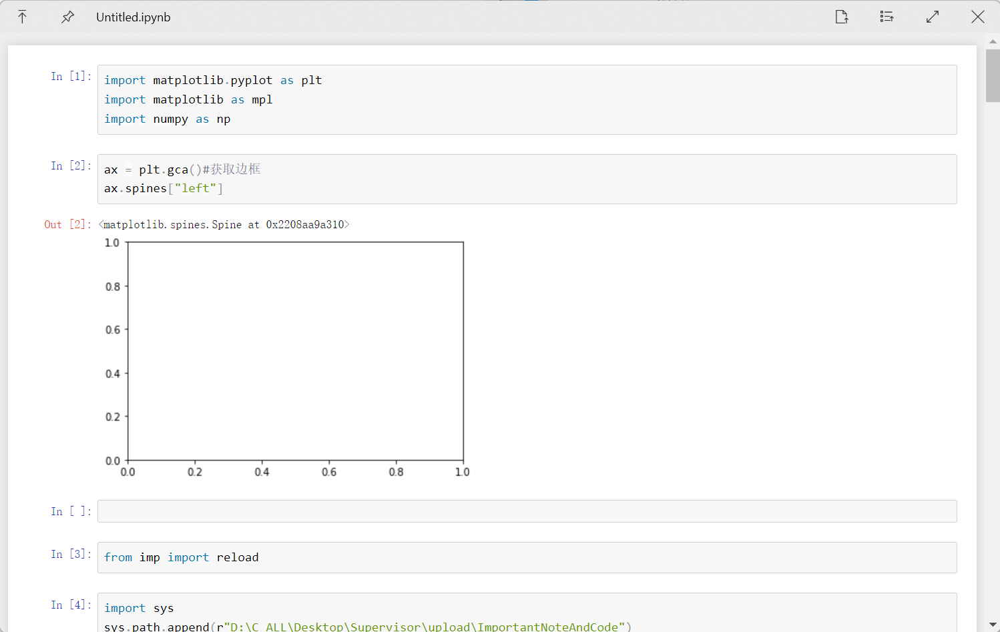

# QuickLook.Plugin.JupyterNotebookViewer

    
    
    

 

**Note**: *It will be slow, if the ipynb file is large (maybe 1M)*

# Download and Installation
1. Go to [Release page](https://github.com/QL-Win/QuickLook.Plugin.HelloWorld/releases) and download the latest version.
2. Make sure that you have QuickLook running in the background. Go to your Download folder, and press Spacebar on the downloaded `.qlplugin` file.
3. Click the "Install" button in the popup window.
4. Restart QuickLook.
5. Select the file(`.ipynb`) and press Spacebar.

# Thanks to
- [@Paddy Xu](https://github.com/xupefei)'s idea in [[feature request] Jupyter notebooks support](https://github.com/QL-Win/QuickLook/issues/462#issuecomment-570641376)
- [QuickLook.Plugin.HtmlViewer](https://github.com/QL-Win/QuickLook/)
- [nbviewer.js](https://github.com/kokes/nbviewer.js): Client side rendering of Jupyter notebooks
- [UTF-unknown](https://github.com/CharsetDetector/UTF-unknown): charset detector build in C# - .NET standard 1.0 & .NET 4+